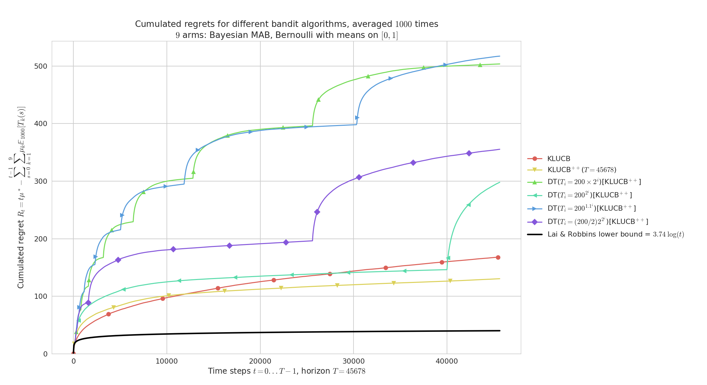
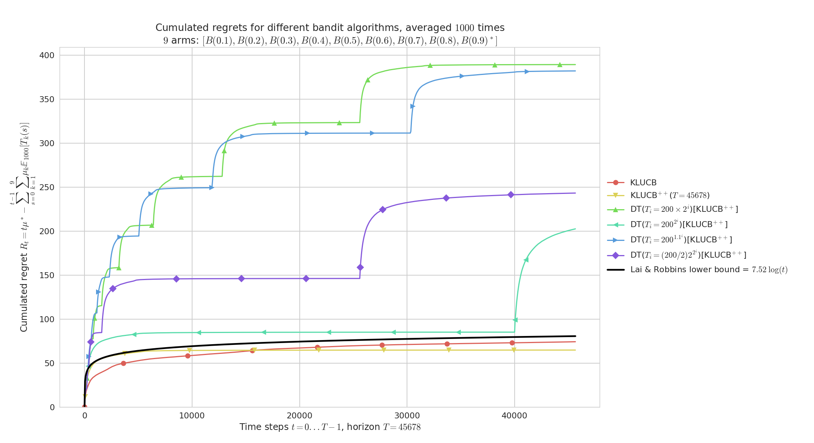
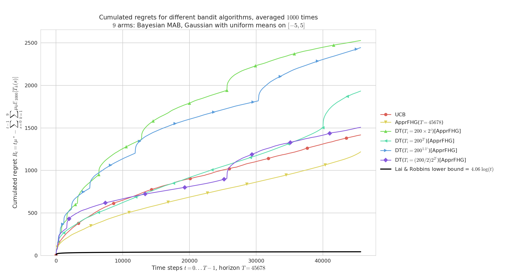
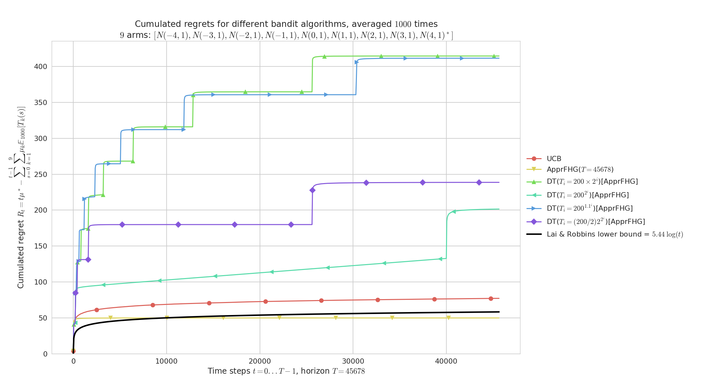
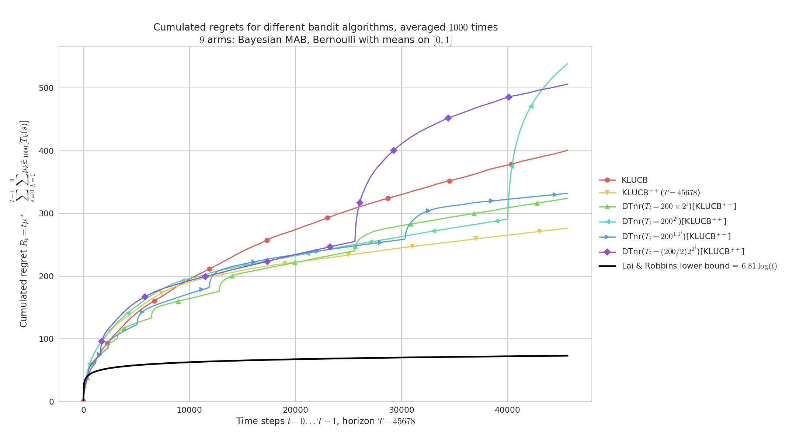
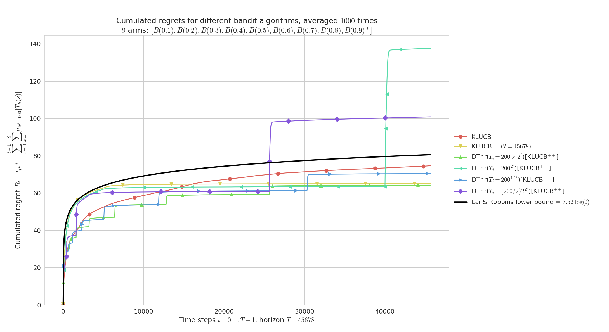

# **Doubling Trick for Multi-Armed Bandits**
I studied what Doubling Trick can and can't do for multi-armed bandits, to obtain efficient anytime version of non-anytime optimal Multi-Armed Bandits algorithms.

- Remark: I wrote a small research article on that topic, it will be a better introduction as a small self-contained document to explain this idea and the algorithms. Reference: [[What the Doubling Trick Can or Can't Do for Multi-Armed Bandits, Lilian Besson and Emilie Kaufmann, 2018]](https://hal.inria.fr/hal-XXX), to be presented soon.


----

## Configuration
A simple python file, [`configuration_comparing_doubling_algorithms.py`](configuration_comparing_doubling_algorithms.py), is used to import the [arm classes](Arms/), the [policy classes](Policies/) and define the problems and the experiments.

For example, we can compare the standard anytime [`klUCB`](Policies/klUCB.py) algorithm against the non-anytime [`klUCBPlusPlus`](Policies/klUCBPlusPlus.py) algorithm, as well as 3 versions of [`DoublingTrickWrapper`](Policies/DoublingTrickWrapper.py) applied to [`klUCBPlusPlus`](Policies/klUCBPlusPlus.py).

```python
configuration = {
    "horizon": 10000,    # Finite horizon of the simulation
    "repetitions": 100,  # number of repetitions
    "n_jobs": -1,        # Maximum number of cores for parallelization: use ALL your CPU
    "verbosity": 5,      # Verbosity for the joblib calls
    # Environment configuration, you can set up more than one.
    "environment": [
        {
            "arm_type": Bernoulli,
            "probabilities": [0.01, 0.01, 0.01, 0.02, 0.02, 0.02, 0.05, 0.05, 0.05, 0.1]
        }
    ],
    # Policies that should be simulated, and their parameters.
    "policies": [
        {"archtype": UCB, "params": {} },
        {"archtype": klUCB, "params": {} },
        {"archtype": klUCBPlusPlus, "params": { "horizon": 10000 } },
    ]
}
```

Then add a Doubling-Trick bandit algorithm ([`DoublingTrickWrapper` class](Policies/DoublingTrickWrapper.py)), you can use this piece of code:

```python
configuration["policies"] += [
    {
        "archtype": DoublingTrickWrapper,
        "params": {
            "next_horizon": next_horizon,
            "full_restart": full_restart,
            "policy": klUCBPlusPlus,
        }
    }
    for full_restart in [ True, False ]
    for next_horizon in [
        next_horizon__arithmetic,
        next_horizon__geometric,
        next_horizon__exponential_fast,
        next_horizon__exponential_slow,
        next_horizon__exponential_generic
    ]
]
```

----

## [How to run the experiments ?](How_to_run_the_code.md)

You should use the provided [`Makefile`](Makefile) file to do this simply:
```bash
make install  # install the requirements ONLY ONCE
make comparing_doubling_algorithms   # run and log the main.py script
```

----

## Some illustrations
Here are some plots illustrating the performances of the different [policies](Policies/) implemented in this project, against various problems (with [`Bernoulli`](Arms/Bernoulli.py) and [`UnboundedGaussian`](Arms/Gaussian.py) arms only):

### Doubling-Trick with restart, on a "simple" Bernoulli problem


Regret for Doubling-Trick, for K=9 Bernoulli arms, horizon T=45678, n=1000 repetitions and µ1,...,µK taken uniformly in [0,1]^K.
Geometric doubling (b=2) and slow exponential doubling (b=1.1) are too slow, and short first sequences make the regret blow up in the beginning of the experiment.
At t=40000 we see clearly the effect of a new sequence for the best doubling trick (T_i = 200 x 2^i).
As expected, kl-UCB++ outperforms kl-UCB, and if the doubling sequence is growing fast enough then Doubling-Trick(kl-UCB++) can perform as well as kl-UCB++ (see for t < 40000).

### Doubling-Trick with restart, on randomly taken Bernoulli problems


Similarly but for µ1,...,µK evenly spaced in [0,1]^K (\{0.1,\dots,0.9\}).
Both kl-UCB and kl-UCB++ are very efficient on "easy" problems like this one, and we can check visually that they match the lower bound from Lai & Robbins (1985).
As before we check that slow doubling are too slow to give reasonable performance.


### Doubling-Trick with restart, on randomly taken Gaussian problems with variance V=1


Regret for K=9 Gaussian arms N(mu, 1), horizon T=45678, n=1000 repetitions and µ1,...,µK taken uniformly in [-5,5]^K and variance V=1.
On "hard" problems like this one, both UCB and AFHG perform similarly and poorly w.r.t. to the lower bound from Lai & Robbins (1985).
As before we check that geometric doubling (b=2) and slow exponential doubling (b=1.1) are too slow, but a fast enough doubling sequence does give reasonable performance for the anytime AFHG obtained by Doubling Trick.

### Doubling-Trick with restart, on an easy Gaussian problems with variance V=1


Regret for Doubling-Trick, for K=9 Gaussian arms N(mu, 1), horizon T=45678, n=1000 repetitions and µ1,...,µK uniformly spaced in [-5,5]^K.
On "easy" problems like this one, both UCB and AFHG perform similarly and attain near constant regret (identifying the best Gaussian arm is very easy here as they are sufficiently distinct).
Each doubling trick also appear to attain near constant regret, but geometric doubling (b=2) and slow exponential doubling (b=1.1) are slower to converge and thus less efficient.


### Doubling-Trick with no restart, on randomly taken Bernoulli problems


Regret for K=9 Bernoulli arms, horizon T=45678, n=1000 repetitions and µ1,...,µK taken uniformly in [0,1]^K, for Doubling-Trick no-restart.
Geometric doubling (\eg, b=2) and slow exponential doubling (\eg, b=1.1) are too slow, and short first sequences make the regret blow up in the beginning of the experiment.
At t=40000 we see clearly the effect of a new sequence for the best doubling trick (T_i = 200 x 2^i).
As expected, kl-UCB++ outperforms kl-UCB, and if the doubling sequence is growing fast enough then Doubling-Trick no-restart for kl-UCB++ can perform as well as kl-UCB++.

### Doubling-Trick with no restart, on an "simple" Bernoulli problems


K=9 Bernoulli arms with µ1,...,µK evenly spaced in [0,1]^K.
On easy problems like this one, both kl-UCB and kl-UCB++ are very efficient, and here the geometric allows the Doubling-Trick no-restart anytime version of kl-UCB++ to outperform both kl-UCB and kl-UCB++.


> These illustrations come from my article, [[What the Doubling Trick Can or Can't Do for Multi-Armed Bandits, Lilian Besson and Emilie Kaufmann, 2018]](https://hal.inria.fr/hal-XXX), to be presented soon.
