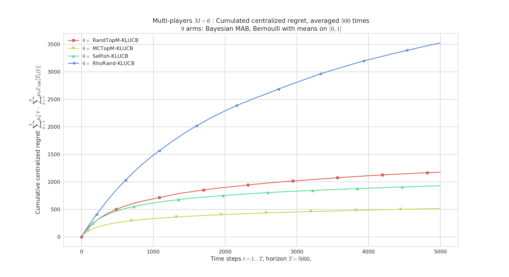
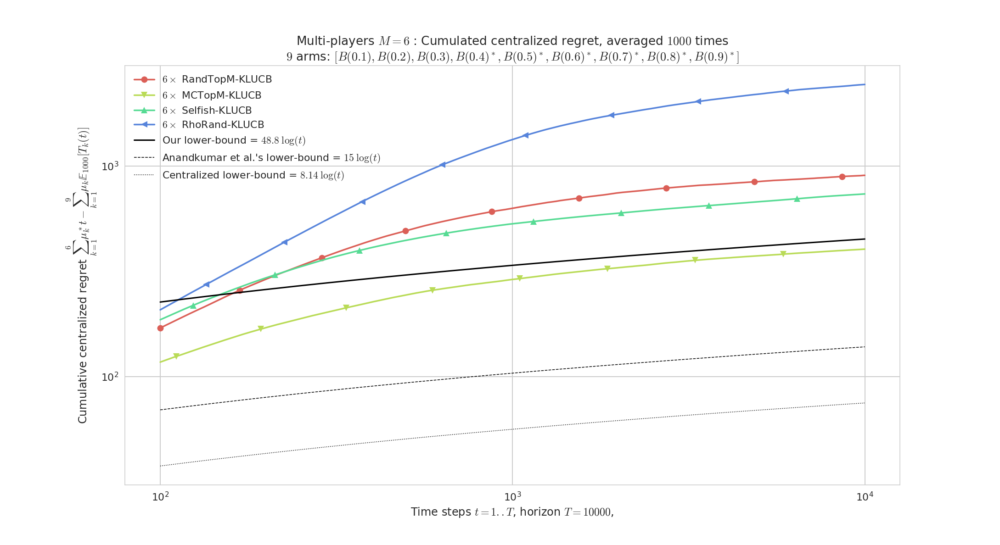
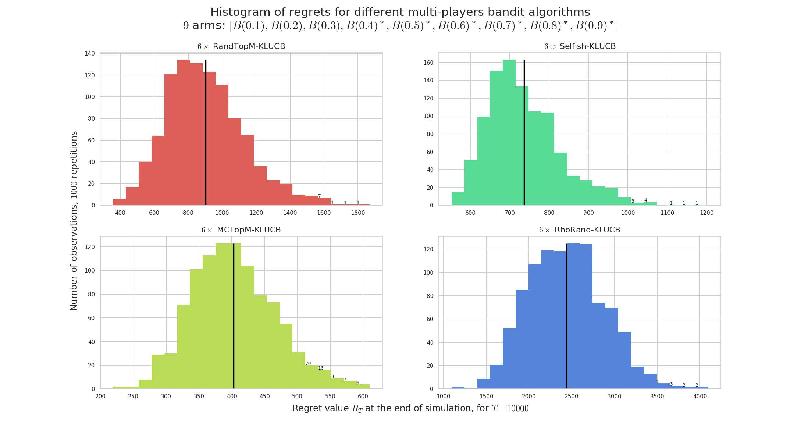

## [**Multi-players simulation environment**](MultiPlayers.md)

> **For more details**, refer to [this article](https://hal.inria.fr/hal-01629733).
>  Reference: [[Multi-Player Bandits Models Revisited, Lilian Besson and Emilie Kaufmann, 2017]](https://hal.inria.fr/hal-01629733), presented at the [Internation Conference on Algorithmic Learning Theorey 2018](http://www.cs.cornell.edu/conferences/alt2018/index.html#accepted).

There is another point of view: instead of comparing different single-player policies on the same problem, we can make them play *against each other*, in a multi-player setting.

The basic difference is about **collisions** : at each time `t`, if two or more user chose to sense the same channel, there is a *collision*. Collisions can be handled in different way from the base station point of view, and from each player point of view.

### Collision models
For example, I implemented these different collision models, in [`CollisionModels.py`](Environment/CollisionModels.py):

 - `noCollision` is a limited model *where* all players can sample an arm with collision. It corresponds to the single-player simulation: each player is a policy, compared without collision. This is for testing only, not so interesting.
 - `onlyUniqUserGetsReward` is a simple collision model where only the players alone on one arm sample it and receive the reward. This is the default collision model in the literature, for instance cf. [[Shamir et al., 2015]](https://arxiv.org/abs/0910.2065v3) collision model 1 or cf [[Liu & Zhao, 2009]](https://arxiv.org/abs/0910.2065v3). [Our article](https://hal.inria.fr/hal-01629733) also focusses on this model.
 - `rewardIsSharedUniformly` is similar: the players alone on one arm sample it and receive the reward, and in case of more than one player on one arm, only one player (uniform choice, chosen by the base station) can sample it and receive the reward.
 - `closerUserGetsReward` is similar but uses another approach to chose who can emit. Instead of randomly choosing the lucky player, it uses a given (or random) vector indicating the *distance* of each player to the base station (it can also indicate the quality of the communication), and when two (or more) players are colliding, only the one who is closer to the base station can transmit. It is the more physically plausible.

----

### More details on the code
Have a look to:
- [`main_multiplayers.py`](./main_multiplayers.py) and [`configuration_multiplayers.py`](./configuration_multiplayers.py) to run and configure the simulation,
- the [`EvaluatorMultiPlayers`](./Environment/EvaluatorMultiPlayers.py) class that performs the simulation,
- the [`ResultMultiPlayers`](./Environment/ResultMultiPlayers.py) class to store the results,
- and some naive policies are implemented in the [`PoliciesMultiPlayers/`](./PoliciesMultiPlayers/) folder. As far as now, there is the [`Selfish`](PoliciesMultiPlayers/Selfish.py), [`CentralizedFixed`](PoliciesMultiPlayers/CentralizedFixed.py), [`CentralizedCycling`](PoliciesMultiPlayers/CentralizedCycling.py), [`OracleNotFair`](PoliciesMultiPlayers/OracleNotFair.py), [`OracleFair`](PoliciesMultiPlayers/OracleFair.py) multi-players policy.

### Policies designed to be used in the multi-players setting
- The first one I implemented is the ["Musical Chair"](https://arxiv.org/abs/1512.02866) policy, from [[Shamir et al., 2015]](https://arxiv.org/abs/0910.2065v3), in [`MusicalChair`](Policies/MusicalChair.py).
- Then I implemented the ["MEGA"](https://arxiv.org/abs/1404.5421) policy from [[Avner & Mannor, 2014]](https://arxiv.org/abs/1404.5421), in [`MEGA`](Policies/MEGA.py). But it has too much parameter, the question is how to chose them.
- The [`rhoRand`](PoliciesMultiplayers/rhoRand.py) and variants are from [[Distributed Algorithms for Learning..., Anandkumar et al., 2010](http://ieeexplore.ieee.org/document/5462144/).
- Our algorithms introduced in [[Multi-Player Bandits Models Revisited, Lilian Besson and Emilie Kaufmann, 2017]](https://hal.inria.fr/hal-01629733) are in [`RandTopM`](PoliciesMultiplayers/RandTopM.py): `RandTopM` and `MCTopM`.
- We also studied deeply the [`Selfish`](PoliciesMultiplayers/Selfish.py) policy, without being able to prove that it is as efficient as `rhoRand`, `RandTopM` and `MCTopM`.

----

### Configuration:
A simple python file, [`configuration_multiplayers.py`](configuration_multiplayers.py), is used to import the [arm classes](Arms/), the [policy classes](Policies/) and define the problems and the experiments.
See the explanations given for [the simple-player case](Aggregation.md).

```python
configuration["successive_players"] = [
    CentralizedMultiplePlay(NB_PLAYERS, klUCB, nbArms).children,
    RandTopM(NB_PLAYERS, klUCB, nbArms).children,
    MCTopM(NB_PLAYERS, klUCB, nbArms).children,
    Selfish(NB_PLAYERS, klUCB, nbArms).children,
    rhoRand(NB_PLAYERS, klUCB, nbArms).children,
]
```

- The multi-players policies are added by giving a list of their children (eg `Selfish(*args).children`), who are instances of the proxy class [`ChildPointer`](PoliciesMultiPlayers/ChildPointer.py). Each child methods is just passed back to the mother class (the multi-players policy, e.g., `Selfish`), who can then handle the calls as it wants (can be centralized or not).

----

### Some illustrations of multi-players simulations



> Figure 1 : Regret, M=6 players, K=9 arms, horizon T=5000, against 500 problems µ uniformly sampled in [0,1]^K. rhoRand (top blue curve) is outperformed by the other algorithms (and the gain increases with M). MCTopM (bottom yellow) outperforms all the other algorithms is most cases.





> Figure 2 : Regret (in loglog scale), for M=6 players for K=9 arms, horizon T=5000, for 1000 repetitions on problem µ=[0.1,dots,0.9]. RandTopM (yellow curve) outperforms Selfish (green), both clearly outperform rhoRand. The regret of MCTopM is logarithmic, empirically with the same slope as the lower bound. The x axis on the regret histograms have different scale for each algorithm.

> These illustrations come from my article, [[Multi-Player Bandits Models Revisited, Lilian Besson and Emilie Kaufmann, 2017]](https://hal.inria.fr/hal-01629733), presented at the [Internation Conference on Algorithmic Learning Theorey 2018](http://www.cs.cornell.edu/conferences/alt2018/index.html#accepted).

----

### Fairness vs. unfairness
For a multi-player policy, being fair means that on *every* simulation with `M` players, each player access any of the `M` best arms (about) the same amount of time.
It is important to highlight that it has to be verified on each run of the MP policy, having this property in average is NOT enough.

- For instance, the oracle policy [`OracleNotFair`](PoliciesMultiPlayers/OracleNotFair.py) affects each of the `M` players to one of the `M` best arms, orthogonally, but once they are affected they always pull this arm. It's unfair because one player will be lucky and affected to the best arm, the others are unlucky. The centralized regret is optimal (null, in average), but it is not fair.
- And the other oracle policy [`OracleFair`](PoliciesMultiPlayers/OracleFair.py) affects an offset to each of the `M` players corresponding to one of the `M` best arms, orthogonally, and once they are affected they will cycle among the best `M` arms. It's fair because every player will pull the `M` best arms an equal number of time. And the centralized regret is also optimal (null, in average).

- Usually, the [`Selfish`](PoliciesMultiPlayers/Selfish.py) policy is *not* fair: as each player is selfish and tries to maximize her personal regret, there is no reason for them to share the time on the `M` best arms.

- Conversely, the [`MusicalChair`](Policies/MusicalChair.py) policy is *not* fair either, and cannot be: when each player has attained the last step, ie. they are all choosing the same arm, orthogonally, and they are not sharing the `M` best arms.

- The [`MEGA`](Policies/MEGA.py) policy is designed to be fair: when players collide, they all have the same chance of leaving or staying on the arm, and they all sample from the `M` best arms equally.

- The [`rhoRand`](PoliciesMultiPlayers/rhoRand.py) policy is not designed to be fair for every run, but it is fair in average.
- Similarly for our algorithms `RandTopM` and `MCTopM`, defined in [`RandTopM`](PoliciesMultiPlayers/RandTopM.py).
